# <싸:라웃> - 음성 분석을 통한 AI 보컬 트레이닝🎤🎵
**SSAFY 9기 2학기 공통 프로젝트 - 싸:라웃**
 [UCC 보러가기](https://youtu.be/fpCaXvi1ilU)  
<br/>
## 서비스 소개
### 개요
- 서비스 명 : 싸:라웃
- 뜻 : `SSAFY`에다 영단어 `Shout out`을 결합한 것으로, 자신의 노래 실력을 맘껏 외치고 뽐내라는 의미
- 기획의도 : 노래방에 가지 않고도 노래 연습을 할 수 있고, 실력을 확인할 수 있는 서비스를 제공하자

### 타겟

- 노래 실력을 키우고 싶은 사람들
- 노래별로 음정, 박자 점수를 받고 성장그래프로 확인하고 싶은 사람들
- 틀린 구간만 따로 연습해보고 싶은 사람들
- AI가 내 목소리로 부른 노래를 들어보고 싶은 사람들
<br/>

## 프로젝트 진행 기간

23.07.10(월) ~ 23.08.18(금)  
<br/>

## 개발 환경

<div align=center>

### Back-end
<p align="center" data-align="center">


</p>


### Front-end
<p align="center">


</p>

### DB
<p align="center">
 


</p>

### Dev-Ops
<p align="center">


</p>

### AI 관련
<p align="center">


</p>

### 협업 tool
<p align="center">


</p>  
<br/>
</div>

## 기능 소개

- SNS 로그인
- 노래 부르기
  - `푸리에 변환`을 활용해 사용자의 노래 음정 표출
  - MR의 음정을 캔버스 위 퍼펙트 스코어 형태로 제공
  - 음정, 박자 코칭
- 분석 결과 및 다시 부르기(연습실)
  - 실시간으로 계산된 `음정, 박자 점수`를 제공
  - 소절 연습 가능
- 노래 검색
  - 검색 결과에서 즐겨찾기 등록
  - `부르러가기` 버튼을 통해 녹음 페이지로 이동
- 마이페이지
  - 프로필
  - 즐겨찾기
  - 기록된 노래
    - 점수 추이를 확인할 수 있는 `성장그래프` 제공
- AI
    - AI 노래 학습을 위한 최소 기준치 5곡 달성 시, `AI 노래 만들어주세요` 버튼 활성화
    - 버튼 클릭 시 AI 노래 생성
    - 생성 완료 시 `AI 노래 들으러 가기` 버튼으로 변경, 클릭 시 AI 노래 페이지로 연결
- 히스토리
  - 부른 곡들을 다시 들을 수 있음
- 회원정보 수정
- 회원탈퇴
- AI가 불러주는 노래
  - 싸라웃에서 제공하는 노래들에 대한 `AI 합성곡`을 들을 수 있음  
<br/>

## 화면구현
|메인화면 & 회원가입|로그인|회원정보수정|
|:---:|:---:|:---:|
|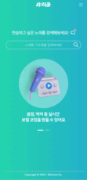|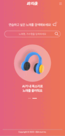||

|전체곡 조회|검색 & 즐찾|검색 후 녹음|
|:---:|:---:|:---:|
|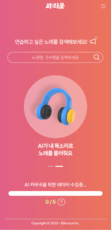|||

|녹음|녹음 후 결과|다시부르기|
|:---:|:---:|:---:|
|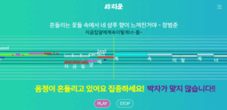|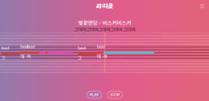||

|마이페이지 즐겨찾기|마이페이지 성장그래프|히스토리|
|:---:|:---:|:---:|
|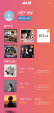|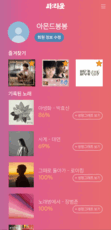|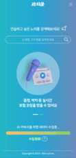|

|녹음한 곡이 4곡일때|한 곡 부르고 AI 게이지 차기|5곡 채운 후 AI 노래 신청|AI 노래 들으러가기 및 재생|
|:---:|:---:|:---:|:---:|
|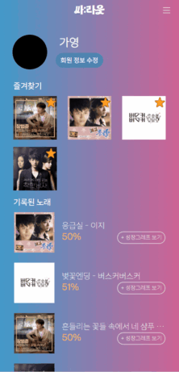||||  
<br/>

## 시스템 아키텍처
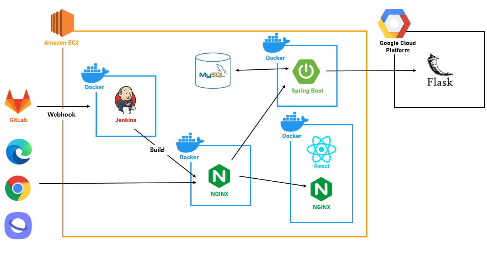  
<br/>

## 목업
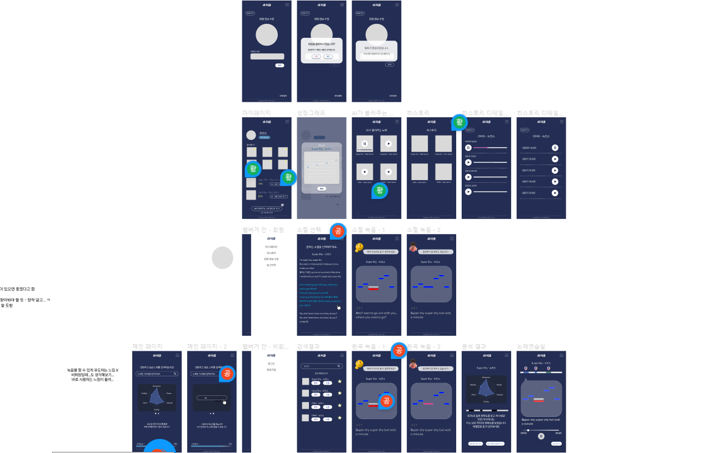  
<br/><br/>

## 프로젝트 구조도


```
📦Front-end
 ┣ 📂public
 ┃ ┣ 📂dist
 ┃ ┃ ┣ 📜index.css
 ┃ ┃ ┗ 📜index.js
 ┃ ┣ 📜burger.png
 ┃ ┣ 📜close.png
 ┃ ┣ 📜emptystar.png
 ┃ ┣ 📜favicon.ico
 ┃ ┣ 📜fullstar.png
 ┃ ┣ 📜HSSantokki-Regular.ttf
 ┃ ┣ 📜index.html
 ┃ ┣ 📜LINESeedKR-Rg.ttf
 ┃ ┣ 📜LINESeedKR-Th.ttf
 ┃ ┣ 📜manifest.json
 ┃ ┣ 📜NewSlider1.png
 ┃ ┣ 📜NewSlider2.png
 ┃ ┣ 📜pause.png
 ┃ ┣ 📜play.png
 ┃ ┣ 📜questmark.png
 ┃ ┣ 📜robots.txt
 ┃ ┗ 📜search.png
 ┣ 📂src
 ┃ ┣ 📂Api
 ┃ ┃ ┣ 📜Api.js
 ┃ ┃ ┗ 📜backupApi.js
 ┃ ┣ 📂assets
 ┃ ┃ ┣ 📜burger.png
 ┃ ┃ ┣ 📜close.png
 ┃ ┃ ┗ 📜questmark.png
 ┃ ┣ 📂components
 ┃ ┃ ┣ 📂AnalysisPage
 ┃ ┃ ┃ ┗ 📜LyricsBars.js
 ┃ ┃ ┣ 📂commonUse
 ┃ ┃ ┃ ┣ 📜burger.png
 ┃ ┃ ┃ ┣ 📜close.png
 ┃ ┃ ┃ ┣ 📜Footer.js
 ┃ ┃ ┃ ┣ 📜Hamburger.js
 ┃ ┃ ┃ ┣ 📜Hamburger.module.css
 ┃ ┃ ┃ ┣ 📜Header.js
 ┃ ┃ ┃ ┣ 📜Header.module.css
 ┃ ┃ ┃ ┣ 📜Sidebar.js
 ┃ ┃ ┃ ┗ 📜Sidebar.module.css
 ┃ ┃ ┣ 📂history
 ┃ ┃ ┃ ┣ 📜HistoryCom.js
 ┃ ┃ ┃ ┣ 📜HistoryCom.module.css
 ┃ ┃ ┃ ┣ 📜HistoryDetailCom.js
 ┃ ┃ ┃ ┣ 📜HistoryDetailCom.module.css
 ┃ ┃ ┃ ┣ 📜pause.png
 ┃ ┃ ┃ ┗ 📜play.png
 ┃ ┃ ┣ 📂mainpage
 ┃ ┃ ┃ ┣ 📜AIProgress.js
 ┃ ┃ ┃ ┣ 📜AIProgress.module.css
 ┃ ┃ ┃ ┣ 📜NewSlider.js
 ┃ ┃ ┃ ┣ 📜NewSlider.module.css
 ┃ ┃ ┃ ┣ 📜NewSlider1.png
 ┃ ┃ ┃ ┣ 📜NewSlider2.png
 ┃ ┃ ┃ ┗ 📜questmark.png
 ┃ ┃ ┣ 📂mypage
 ┃ ┃ ┃ ┣ 📜Favorite.js
 ┃ ┃ ┃ ┣ 📜Favorite.module.css
 ┃ ┃ ┃ ┣ 📜MakeAI.js
 ┃ ┃ ┃ ┣ 📜MakeAI.module.css
 ┃ ┃ ┃ ┣ 📜RecordedSongs.js
 ┃ ┃ ┃ ┗ 📜RecordedSongs.module.css
 ┃ ┃ ┗ 📂search
 ┃ ┃ ┃ ┣ 📜emptystar.png
 ┃ ┃ ┃ ┣ 📜fullstar.png
 ┃ ┃ ┃ ┣ 📜none.png
 ┃ ┃ ┃ ┣ 📜search.png
 ┃ ┃ ┃ ┣ 📜SearchBar.js
 ┃ ┃ ┃ ┣ 📜SearchBar.module.css
 ┃ ┃ ┃ ┣ 📜SearchResult.js
 ┃ ┃ ┃ ┗ 📜SearchResult.module.css
 ┃ ┣ 📂lib
 ┃ ┃ ┣ 📜PageBlock.js
 ┃ ┃ ┣ 📜PrivateRoute.js
 ┃ ┃ ┗ 📜PublicRoute.js
 ┃ ┣ 📂pages
 ┃ ┃ ┣ 📜Analysis.js
 ┃ ┃ ┣ 📜Analysis.module.css
 ┃ ┃ ┣ 📜Growth.js
 ┃ ┃ ┣ 📜Growth.module.css
 ┃ ┃ ┣ 📜History.js
 ┃ ┃ ┣ 📜History.module.css
 ┃ ┃ ┣ 📜HistoryDetail.js
 ┃ ┃ ┣ 📜HistoryDetail.module.css
 ┃ ┃ ┣ 📜Login.js
 ┃ ┃ ┣ 📜Login.module.css
 ┃ ┃ ┣ 📜MainPage.js
 ┃ ┃ ┣ 📜MainPage.module.css
 ┃ ┃ ┣ 📜MyPage.js
 ┃ ┃ ┣ 📜MyPage.module.css
 ┃ ┃ ┣ 📜NickNamePage.js
 ┃ ┃ ┣ 📜NickNamePage.module.css
 ┃ ┃ ┣ 📜OauthRedirect.js
 ┃ ┃ ┣ 📜RecordLine.js
 ┃ ┃ ┣ 📜Redirection.js
 ┃ ┃ ┣ 📜Redirection.module.css
 ┃ ┃ ┣ 📜SearchResult.js
 ┃ ┃ ┣ 📜SearchResult.module.css
 ┃ ┃ ┣ 📜SingingAI.js
 ┃ ┃ ┣ 📜SingingAI.module.css
 ┃ ┃ ┣ 📜UserUpdate.js
 ┃ ┃ ┗ 📜UserUpdate.module.css
 ┃ ┣ 📂test
 ┃ ┃ ┣ 📜DOMUtil.js
 ┃ ┃ ┣ 📜EventEmitter.js
 ┃ ┃ ┣ 📜index.js
 ┃ ┃ ┣ 📜Model.js
 ┃ ┃ ┣ 📜reportWebVitals.js
 ┃ ┃ ┣ 📜ScoreDrawer.js
 ┃ ┃ ┣ 📜ScoreParser.js
 ┃ ┃ ┣ 📜setupTests.js
 ┃ ┃ ┣ 📜Sharer.js
 ┃ ┃ ┣ 📜SongEditor.css
 ┃ ┃ ┣ 📜SongEditor.js
 ┃ ┃ ┣ 📜SongList.js
 ┃ ┃ ┣ 📜style.css
 ┃ ┃ ┣ 📜test.css
 ┃ ┃ ┣ 📜Test.js
 ┃ ┃ ┣ 📜ToneDetector.js
 ┃ ┃ ┗ 📜ToneGenerator.js
 ┃ ┣ 📜App.css
 ┃ ┣ 📜App.js
 ┃ ┣ 📜App.test.js
 ┃ ┣ 📜index.css
 ┃ ┣ 📜index.js
 ┃ ┣ 📜logo.svg
 ┃ ┣ 📜mr.mp3
 ┃ ┣ 📜reportWebVitals.js
 ┃ ┗ 📜setupTests.js
 ┣ 📜.gitignore
 ┣ 📜default.conf
 ┣ 📜Dockerfile
 ┣ 📜dockerignore
 ┣ 📜package-lock.json
 ┣ 📜package.json
 ┗ 📜README.md
```  
<br/>


## 팀원

|Front-End|Front-End|Front-End|Back-End|Back-End|Back-End|
|:---:|:---:|:---:|:---:|:---:|:---:|
|||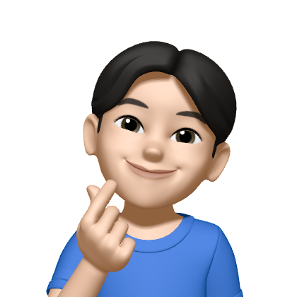||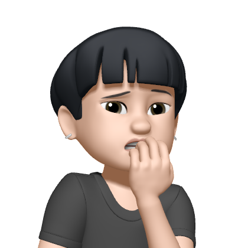||  
|공정민|이가영|이세울|김창혁|심규렬|황세진|
